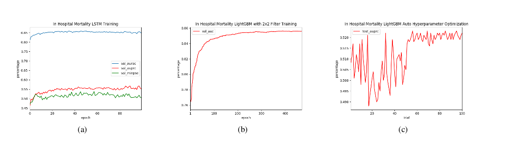
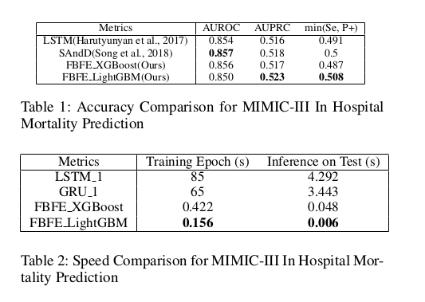
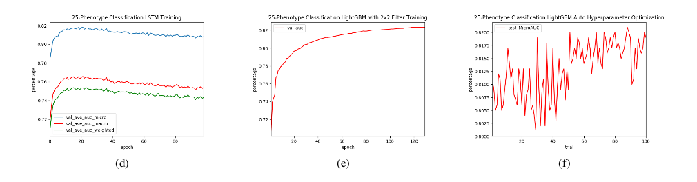
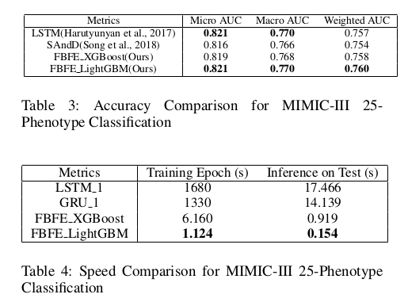

MIMIC-III Time Series Models
=========================

## Motivation

"Deep Learning" has been a buzz word since its big success in ImageNet 2012 competition, and greatly pushing forward the research frontier in computer vision, speech recognition and NLP since then, but for a larger portion of real world applications that deal with graph data and tabular data, such as social networks, recommendation systems and so on, deep learning techniques haven't shown significant advantages. In this work, we focus on time series tasks, which on one hand are in tablur data format, while on the other hand can be applied with both traditional machine learning techniques and deep learning techniques. We will compare the accuracy and speed performance of different modeling approaches and explore model structures that best suitable for time series tasks in Healthcare domain. 

## Data preparation

We do not provide the MIMIC-III data itself. You must acquire the data yourself from https://mimic.physionet.org/. Specifically, download the CSVs. Otherwise, generally we make liberal use of the following packages:

- numpy
- pandas

To extract time series data from MIMIC-III, you need to refer  https://github.com/YerevaNN/mimic3-benchmarks. **Please be sure also to cite the original [MIMIC-III Benchmarks paper](https://www.nature.com/articles/s41597-019-0103-9) and the original [MIMIC-III paper](http://www.nature.com/articles/sdata201635).**

## Experiments

### In-hospital mortality prediction

	
	
 LSTM  training VS LightGBM training

	
	
 Accuracy comparison and Speed Comparison 

### Phenotype classification

	
	
 LSTM  training VS LightGBM training

	
	
 Accuracy comparison and Speed Comparison 

For training and testing models for these 2 time series tasks, please refer to [Command.md](Command.md) , there are also jupyter notebooks showing running logs.

### Questions

Please feel free to reach me (Yanke Hu) or Raj (Raj Subramanian) for any questions or just open a github issue.